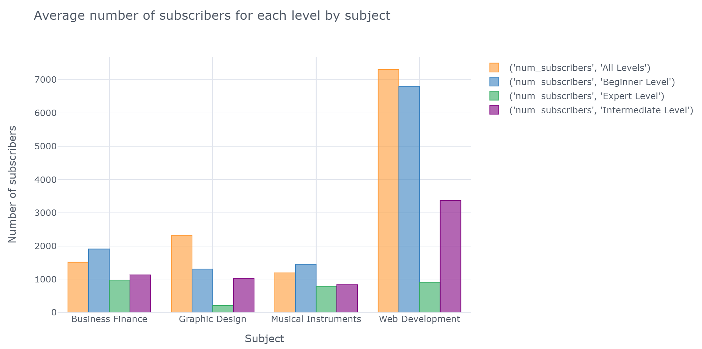
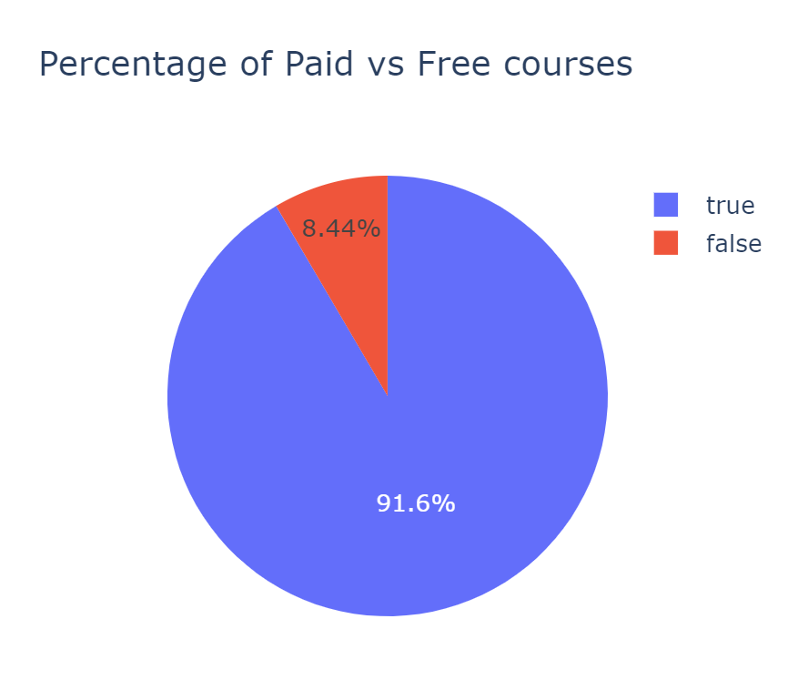
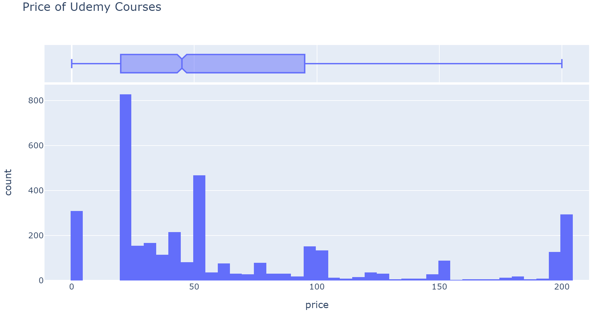
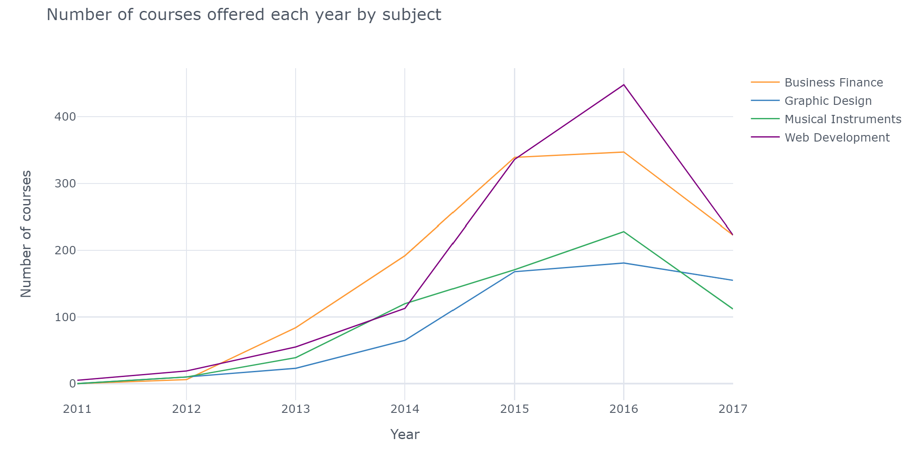

# Data analysis on Udemy courses data
* Ran data analysis and answered 15 questions which can help discovering useful information from the dataset.
* Produced some graphs that can make understanding the dataset easy

## Programming Language & Packages
* Python
* Packages: numpy, pandas, matplotlib, seanborn, plotly, wordcloud, cufflinks.

## Data preprocessing
The dataset is well formated, there was no missing values. Just some data cleaning was made as following:
* The dataset had 2 duplicat rows, this rows were removed.
* A new column was created out of the 'published_timestamp' column. The new column (published_date) is a datatime object.
* Three column was droped as they are not suited for the anlysis. These columns are 'url', 'course_id' and 'published_timestamp'

## Exploratory Data Analysis (EDA)
Ran some python code to get answers for 15 questions. This questions are:
* 1. what are the learning paths Udemy offering courses for
* 2. which path has the most number of courses
* 3. how many courses are Free and how many are paid, which of these 2 people are subscribing to.
* 4. find the number of paid courses and free courses by subject.
* 5. find top 10 most bought(subscribed to) courses.
* 6. find the least selling courses
* 7. check the distripution of the courses prises. 
* 8. check the distripution of the courses duration.
* 9. how many course offering the Python programming language 
* 10. find the number of offered courses by year. 
* 11. find the number of offered courses by leve. 
* 12. find the average number of subscribers for each level by subject.
* 13. check which subject has the highest average subscribers for 'Expert level'
* 14. find the average course duration by subject
* 15. does content_duration affects the price

## Visualizing
Using different plots to make the dataset easy to understand and to draw som insights from it. 
Some of these plots are ment to check the correlations, others are ment to find some info related to the subjects offered by Udemy.

    

## Resources
Udemy courses dataset: https://www.kaggle.com/andrewmvd/udemy-courses  
